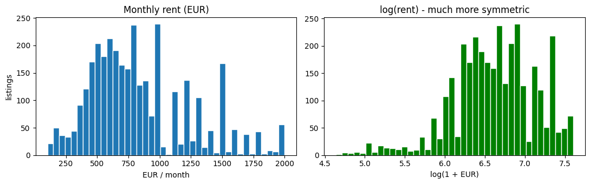
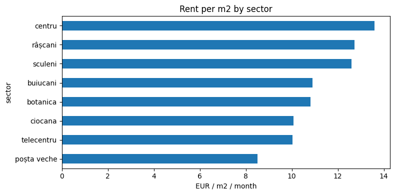
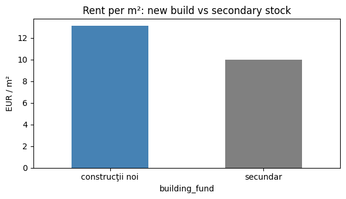
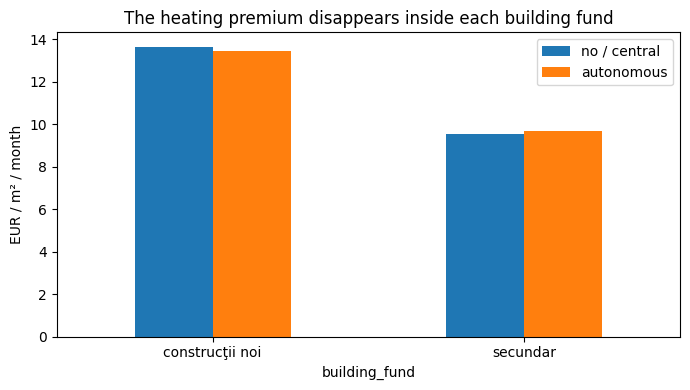

# Is this Chișinău apartment overpriced?

My first machine learning project. I scraped about 4,500 real apartment rental listings from a
Moldovan classifieds site, trained a model on them, and built a small app that estimates a fair
monthly rent and tells you whether a given listing is overpriced or a good deal.

The idea: when you're hunting for a flat to rent in Chișinău, you never really know if the asking
price is normal, too high, or too low, unless you happen to be an agent or an analyst yourself. So I
built a tool that compares a listing against the whole market and explains *why* it thinks the rent
is fair or not.

There's a live demo at [https://pret-drept-tm6owb5eka-ew.a.run.app](pret-drept-tm6owb5eka-ew.a.run.app).
It runs on Google Cloud Run, which spins the container down when nobody's using it, so the first
request after a quiet spell takes a few seconds to wake up.

---

## What does it predict?

You give it an apartment (rooms, area, sector, floor, heating, furnishing, and so on) and it hands
back:
- an estimated fair monthly rent in EUR
- a verdict: overpriced, fair, or a good deal
- the top five reasons behind that number, so it isn't just a black box handing you a figure

---

## The data

Everything comes from [999.md](https://999.md), filtered to long-term monthly rentals in Chișinău.
999.md is a JavaScript site, so a plain HTML scraper just reads an empty shell. Its frontend talks to
a public GraphQL API though, and that API returns every listing as clean structured JSON: price with
its currency, area, rooms, floor, sector, heating type, furnishing, even GPS coordinates. So
`scrape.py` queries the API directly. No HTML parsing, no headless browser. I try to be a decent
guest about it too: I filter server-side to exactly what I need, lean on the API's own duplicate
collapsing, pause between requests, and save as I go.

That gives 4,528 listings, or 3,557 after cleaning (the two trims below take it to about 3,400).
Cleaning drops rows missing area, price, or rooms, drops reposted duplicates, and keeps rent between
100 and 2000 EUR - normal flats, which is what this tool is for (more on the cap in "Where it falls
short"). Then two more trims. I cut the worst 1% of rent-per-m² on each end, which is almost always
someone fat-fingering the area or the price. And I drop any listing asking less than half or more
than double what its own 15 GPS neighbours charge: if everyone around you rents at 10 EUR/m² and you
want 25, that's not a price, that's a wish, and the app's job is to catch listings like that, not to
learn from them. The 1% cutoffs and the medians I use to fill in missing values are computed on the
training split only, so validation rows never sneak into what the model learns from. The neighbour
rule is just two fixed numbers (0.5x and 2x), so there's nothing to leak there. About 95% of
listings are priced in EUR and the rest in MDL or USD; I convert everything to EUR at a fixed
19.5 MDL/EUR (BNM, mid-2026). The snapshot was collected in July 2026.

---

## What the market actually looks like

Before training anything I spent a while just looking at the data
([`notebooks/eda.ipynb`](notebooks/eda.ipynb) has the full tour). A few things stood out.

Rent is heavily skewed: lots of ordinary flats and a long tail of expensive ones. Taking the log
makes it roughly symmetric, which is the whole reason the model trains on `log(price)`.



Location does most of the work. Centru goes for about 13.6 EUR/m² while the outer sectors sit around
8.5 to 10.9, with a clean centre-outward gradient in between.



The biggest single gap is new build versus old Soviet stock: +32% per m², 13.1 against 9.9 EUR/m².



My favourite finding is that autonomous heating turns out not to be a price driver at all. Moldova
went through an energy crisis recently, so everyone assumes flats with their own heating rent for
more, and the raw numbers agree (+7%). But autonomous heating is standard in new buildings, and new
buildings cost more for other reasons anyway. Compare inside each building fund and the premium
disappears completely. It was the new-building effect all along.



Smaller stuff: each extra m² is worth about 11 EUR/month (small flats are pricier per m²), the ground
floor is a real discount (-10%), furnishing adds nothing since here it's simply expected, and ads
that brag about a penthouse or a jacuzzi really do ask ~19% more per m².

---

## Cleaning and features

The JSON is clean in the sense that it's structured, but the values themselves are a mess. Fields
come in Romanian and Russian, people type ceiling height as "3", "28", or "280" depending on their
mood, and a third of the useful information is buried in the free-text ad. Almost all of the work in
this project lives in `features.py`, which turns each raw listing into the numbers the model actually
sees.

The plain features are what you'd expect: rooms, area, floor and total floors, kitchen area, ceiling
height, balcony count, sector, building fund (new vs secondary), condition, who's selling (agency,
owner, or developer), and a pile of yes/no amenities (autonomous heating, furnished, elevator,
parking, AC, terrace, and so on).

Three of them took actual thought:

- The neighbour price. For each apartment I find its 15 closest listings by GPS and take their median
  EUR/m². That's basically what a person does when sizing up a price: you look around. It turned out
  to be the strongest single signal in the model. I compute it from the training rows only, though,
  or a listing would get to peek at its own neighbours and the scores would come out fake-good.
- Reading the ad text. Around a third of listings leave the condition field empty but describe it in
  words ("euroreparație", "евроремонт"). I pull those back out with keyword matching in both
  languages. Same trick for spotting when the rent already includes utilities, which otherwise
  quietly throws the price off. The text is also the only place a flat admits it's fancy: in the
  structured fields a penthouse and a regular flat of the same size look identical (both just say
  "euroreparație"), so I also pull out a bathroom count ("2 blocuri sanitare", "2 санузла") and a
  premium flag for words like penthouse, jacuzzi or "clasă premium". Before that, the model priced
  every big flat in Centru like an average one.
- Training on log(price) instead of price. Rent skews hard toward the cheap end, so I fit on the log
  and convert back at the end. Without that, the handful of expensive flats dominate the error and
  the model basically ignores everything under 1000 EUR.

---

## Picking the model

`train.py` uses XGBoost, and not just because XGBoost is the fashionable pick. The whole argument
lives in [`notebooks/model_selection.ipynb`](notebooks/model_selection.ipynb). There I run a dumb
baseline, linear regression, ridge, random forest, gradient boosting, and XGBoost over the same data
and the same split, score them the same way, confirm the order with 5-fold cross-validation, and tune
the two best. Roughly where they land (RMSE in real EUR of rent):

| model | CV RMSE |
|---|---|
| dumb baseline (one price per m², times area) | ~290 |
| linear regression | 231 |
| gradient boosting | 196 |
| random forest, tuned | 188 |
| **XGBoost, tuned** | **186** |

So the shipped model is off by about 130 EUR (15.7% MAPE) on a typical listing. Median rent in the
data is 750. Not amazing, but every model beats the dumb baseline by a mile, and even a plain
straight line explains 64% of the variance, which told me the features were pulling their weight
before I ever touched a tree.

One honest note about where these numbers come from. The table above is 5-fold cross-validation
from the notebook. The model I actually ship gets retrained by `train.py` on a single fixed 80/20
split (`random_state=42`), and its own holdout scores go into `model.joblib` and get printed every
time the API loads it: MAE 130 EUR, MAPE 15.7%, RMSE 183, R² 0.80. The holdout agrees with the CV
(183 vs 186 ± 5), so this split isn't a lucky one. A detail I like from the notebook: untuned,
random forest was actually a hair ahead of XGBoost. XGBoost only takes the lead after both get a
proper search, so it earns its spot, barely.

Also, the headline number is MAE now, not RMSE. I spent a while chasing the gap between the two
(183 vs 130), convinced something was broken in the data. It wasn't. The model misses by roughly
the same percentage everywhere (~16%), but 16% of a 1,600 EUR flat is four times 16% of a 400 EUR
one, and RMSE squares every miss, so a handful of expensive flats end up deciding the whole number.
I even checked by shuffling the percentage errors between listings: a model that missed everyone by
the same percentage would show an even *bigger* gap than mine does. So the gap is just what rent
prices look like, not a bug. MAE tells you what happens on a typical listing, RMSE tells you how
rough the expensive end gets, and I keep both around.

The tuned XGBoost settings (found by random search in the notebook):

```
n_estimators=600, max_depth=6, learning_rate=0.05,
subsample=0.83, colsample_bytree=0.77, min_child_weight=7
```

---

## Where it falls short

Worth being upfront about a few things:

- It's built for normal flats, not luxury. I cap rent at 2000 EUR/month on purpose (it used to be
  3000). The ~4% above that are premium places whose price sits in things my fields simply don't
  have: which residence it is, the finishes, the view. The model can't see any of that, so it
  priced them all like ordinary flats, missed by 600-1000 EUR, and those few misses were quietly
  deciding my metrics. So they're out. The catch: give it a genuinely premium apartment and it will
  lowball the rent and cry "overpriced" at a listing that might just be expensive for a reason.
- It only knows what the listing says. A beautiful flat with a lazy description, or a scam with a
  great one, will fool it exactly the way it would fool you.
- It's a July 2026 snapshot. Prices move, so it needs re-scraping and re-training now and then to
  stay honest.

---

## Running it

Python 3.13. First:

```bash
pip install -r requirements.txt
```

Start the app (you need a trained `model.joblib` for this):

```bash
uvicorn api:app --reload
# then open http://127.0.0.1:8000
```

Rebuild everything from scratch:

```bash
python scrape.py    # grabs fresh listings into data/raw/listings.csv
python train.py     # cleans, trains, writes model.joblib
```

Or try a single prediction from the terminal: `python predict.py` runs the example apartment at the
bottom of that file.

Run the tests (they cover the cleaning rules, the features, and the API):

```bash
python -m pytest
```

If you'd rather not install Python at all, there's a Dockerfile. It trains the model itself during
the build, so there's nothing to set up first:

```bash
docker build -t chisinau-rent .
docker run -p 8000:8000 chisinau-rent
```

---

## Trying the live API

It's deployed at [pret-drept-tm6owb5eka-ew.a.run.app](https://pret-drept-tm6owb5eka-ew.a.run.app): the site itself, plus a
JSON API you can hit directly:

```bash
curl -X POST "https://pret-drept-tm6owb5eka-ew.a.run.app/predict" \
  -H "Content-Type: application/json" \
  -d '{"rooms": 2, "area": 50, "floor": 3, "total_floors": 9, "sector": "centru", "author": "agenție"}'
# expect: {"fair_price": 638, "listed_price": null, "drivers": [...]}
# add "price": <listed rent> to also get "deviation_pct" and a "verdict"
```

---

## What's where

```
scrape.py                  999.md GraphQL scraper -> data/raw/listings.csv
features.py                all the cleaning and feature engineering
train.py                   trains XGBoost, saves model.joblib
predict.py                 loads the model, makes one prediction + explanation
api.py                     FastAPI - /predict, /options, /health, serves the page
app/index.html             the one-page front end (form in, verdict out)
Dockerfile                 containerised API
notebooks/eda.ipynb        exploratory analysis
notebooks/model_selection.ipynb   the "why XGBoost" comparison
data/raw/listings.csv      the scraped data
images/                    charts from the EDA
tests/                     unit tests for the cleaning rules, features and the API
```

One thing I'm a little proud of: `features.py` is the only place the cleaning rules live, and
training, prediction, and the API all import from it, so they can't quietly disagree about what
"ground floor" means or how a price gets converted. And `model.joblib` holds more than the model. It
also stores sensible per-sector defaults, so the site can fill in the things a normal person would
never type (GPS coordinates, ceiling height, photo count) from just the sector you picked.

---

## Still on the list

- Github Actions (CI).
- A wider hyperparameter search. The current one is only 10 random draws, so 186 is more of a
  ceiling than the real best.
- Some kind of confidence range instead of a single number.
- Re-scraping on a schedule so it doesn't go stale.
- Eventually: sale prices too.
